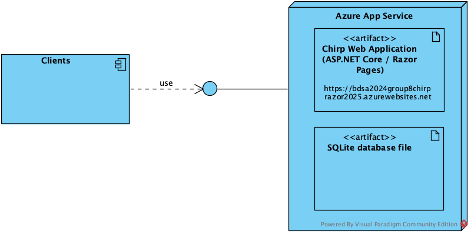
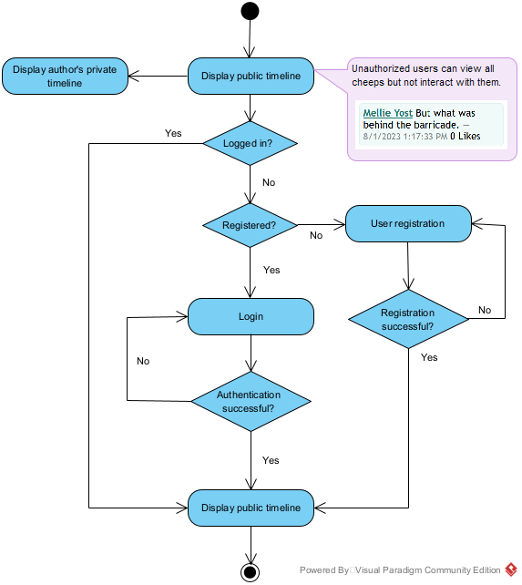
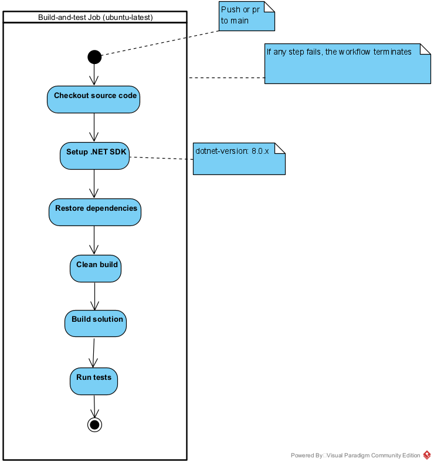
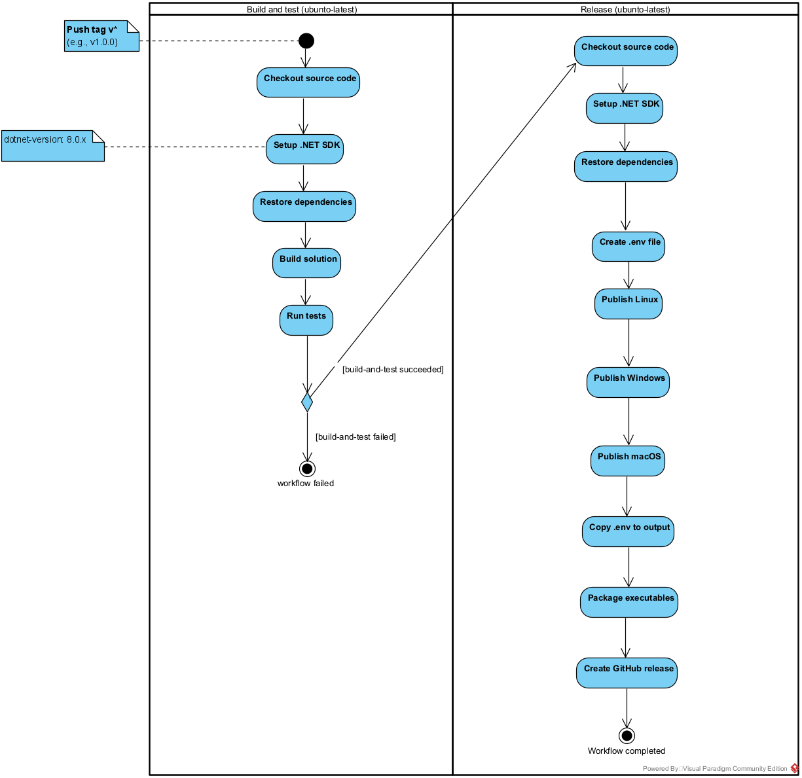
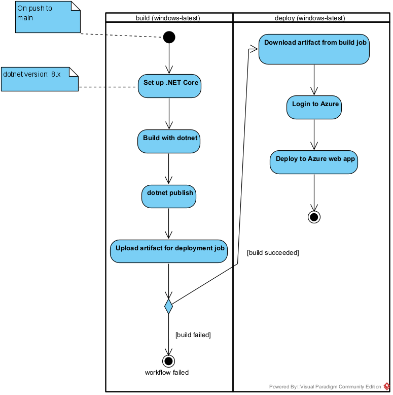
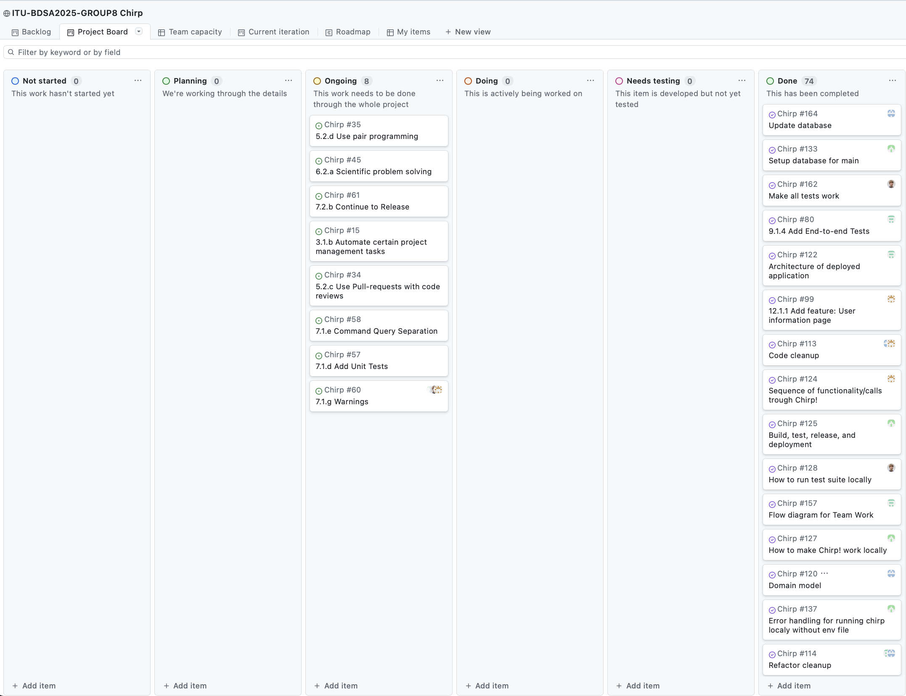
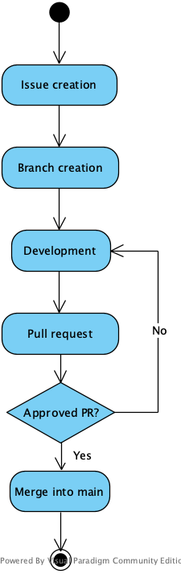
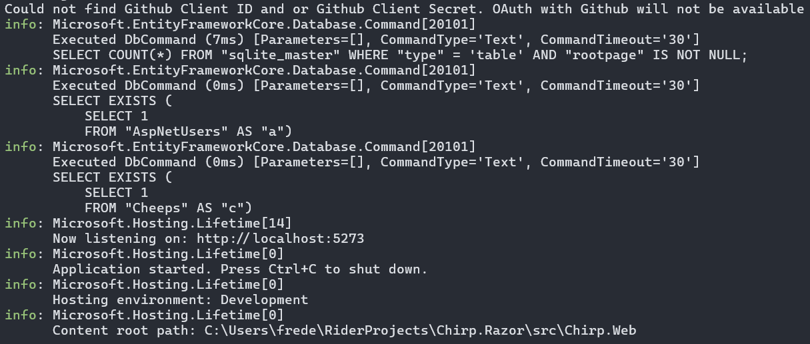

# Design and Architecture of _Chirp!_

## Domain model

The Domain Model of the Chirp! application consists of `Cheep`, `Author` and `IdentityUser`. A `Cheep` is written by an `Author` that inherits from `IdentityUser` as visualized below.


<br>
*Illustration of the _Chirp!_ Domain Model*

## Architecture — In the small
The code base is structured according to the onion architecture template,
with one notable exception. Usually, the domain entities are situated within the core of the application,
which was also the case for this app, before EF Core Identity was implemented.
With this task came some decisions about how to handle the Author/IdentityUser semantics.
Ultimately, it was decided that IdentityUsers and Cheep Authors would be combined
by having the Author class inherit from IdentityUser,
to avoid complications between different types of user accounts.
As a result, the domain entities were moved to `Chirp.Infrastructure`
to accommodate this decision.
Besides this discrepancy, the Chirp! application adheres to the standard onion architecture template.
Below is an overview of the codebase structure.


<br>
*Illustration of the Chirp! app codebase structure - based on onion architecture.*

- `Chirp.Core` contains the interfaces and data transfer objects (DTOs).
- `Chirp.Infrastructure` contains the domain entities, repositories, and the Data package,
which is responsible for the DB context and initializing. The Cheep and Author services are also situated here.
- `Chirp.Web` contains the Program.cs file, all razor pages and their respective page handlers.
- The test suite resides in a separate directory that mirrors the structure of the source code. I.e. the tests for
`src/Chirp.Infrastructure/Repositories/CheepRepository.cs`
are found in
`tests/Chirp.Infrastructure.Tests/Repositories/CheepRepositoryTest.cs`.
UI and end-to-end tests generated using Playwright are located in `Chirp.Web.Tests`.

## Architecture of deployed application
The diagram below shows the deployment architecture of the Chirp! application. The system follows a client-server architecture, where users interact with the application through a web browser. Client requests are sent over HTTPS to an ASP.NET Core Razor Pages application deployed on Azure App Service.
<br> The web application is responsible for handling application logic. Data is stored in a local SQLite database file that is deployed together with the application. A single client node is shown in the diagram. This node represents an arbitrary number of concurrent clients that can interact with the deployed application simultaneously.
<br>

<br>
*Deployment architecture of the Chirp! application.*

## User activities
The first page any Chirp! user sees is the public timeline which displays all Cheeps.
Unauthorized users are limited to browsing Cheeps on this public timeline
and visiting other Authors' private timelines. If a user wishes to further interact with
the application, authentication is required as illustrated by the diagram below.


<br>
*A typical unauthorized user's journey before and through the authentication process.*

The majority of the app's functionality is exclusively available to authorized users.
Specifically, creating Cheeps, liking Cheeps and following other Authors.
Authorized users can also view their user-information on the About Me page,
as well as choose to delete their account from the application.


<br>
*A typical authorized user's journey through the Chirp! application.*

## Sequence of functionality/calls through _Chirp!_

<br>
*Illustration of the sequence of functionality/calls trough _Chirp!_ from an unauthorized user's perspective.*

The image above illustrates the sequence of interactions which occurs, when an unauthorized user first 
accesses the application on the public timeline. An HTTP GET request to the root endpoint "/" is received by 
ASP.NET Core, which calls the Public Model's (`public.cshtml.cs`) OnGetAsync method.
From there, the user is identified as unauthenticated by the ASP.NET Core authentication system and treated as 
anonymous. Through a couple of lifelines, a list of Cheeps is collected and returned to ASP.NET Core. ASP.NET 
Core then renders the `public.cshtml` page through the Razor Page engine and returns the rendered HTML 
to the user.
TimelineBaseModel is illustrated in the diagram to for transparency about communication as the calls between the 
Razor Pages otherwise would be hidden due to being internal.


# Process

## Build, test, release, and deployment
The building, testing, releasing and deploying with GitHub is done using GitHub Actions and their respective workflows. For this project there are 3 workflow files that complete these actions.    
The first workflow builds and tests the Chirp! application upon a push or pull request to the main branch. The activity diagram for the workflow can be seen below, where the note for the initial node also mentions the condition for when the workflow runs.

 <br> *Activity diagram for building and testing Chirp!*

The second workflow builds and releases the Chirp! application upon pushing a tag starting with a v. The activity diagram for the workflow can be seen below, where it also shows that the release job only runs if the build job succeeds.

 <br> *Activity diagram for building and releasing Chirp!* 

The last workflow builds and deploys the Chirp! application to Azure upon a push to main. The activity diagram for the workflow can be seen below, where it also shows that the deploy job only runs if the build job succeeds.

 <br>  *Activity diagram for building and deploying Chirp! to Azure*


## Team work
The picture below shows the GitHub project board used by the group to coordinate and track development work.
<br>

<br> *Screenshot of Project Board in GitHub.*   
<br> All issues have been completed and moved to *Done*, except those in the *Ongoing* column. 
The issues in this column represent the practices that were applied continuously throughout the whole project rather than issues with a clear completion point.
<br> An example of this is "5.2.c Use Pull-requests with code reviews".
Such issues were intentionally kept in the *Ongoing* column, as they served as reminders of the practices the team should follow for every issue.
<br> Although these issues could formally be moved to *Done* upon project submission, we chose to leave them to reflect their role as ongoing guidelines rather than one-time activities.

Shown in the flow of activities below is the workflow of our project development. 
<br>Development starts with issue creation in GitHub, specified using user stories that describes the desired functionality and acceptance criteria.
<br>After issue creation, the team agrees on responsibility for the task, researching the subject and consulting the lecture material. A dedicated feature branch is created, as we work with trunk-based development. The functionality is then developed and tested in isolation, often utilizing pair programming.
<br>When the feature is completed, a pull request is opened and thereafter reviewed by teammates. If the pull request is not approved, the assignee makes changes according to reviewer feedback. Once approved, the changes are merged into the main branch.

   
<br> *Workflow showing the development process from issue creation to merging into the main branch.*

## How to make _Chirp!_ work locally
The Chirp! application runs on .NET 8 so you need to have that installed before you can run it. It can be downloaded **_[here](https://dotnet.microsoft.com/en-us/download/dotnet/8.0)_**

To run Chirp! locally you first need to clone the repository. There are different ways to do this depending on your operating system and own preferences using git. **_[Here](https://docs.github.com/en/repositories/creating-and-managing-repositories/cloning-a-repository?tool=webui)_** is a general guide on how to do it 

After you have cloned the repository, open it in either a code editor or terminal and locate the solution folder. Before you can run the program you first need to navigate to the directory that has the program.cs file, which can be done with the following command:

`cd .\src\Chirp.Web\`

Now you can run Chirp! using the command:  

`dotnet run`

If execution was successful you should receive a terminal output that looks like this:    

    
*Output from terminal when starting the program*

Then open the url. The default is http://localhost:5273.

Because of how OAuth works, you will not be able register or login with GitHub locally, as stated in the terminal:

> Could not find GitHub Client ID and or GitHub Client Secret. OAuth with GitHub will not be available

If you want to try the OAuth functionality, use the deployed version found **_[here](https://bdsa2024group8chirprazor2025.azurewebsites.net/)_**

## How to run test suite locally

### Prerequisites
1. Clone the repository. Follow the steps outlined in the previous section.
2. Install Playwright, which is required for the integration tests.
Follow the official documentation **_[here](https://playwright.dev/docs/intro)_** - or if you are
on Windows, install by running the following commands from the project root:

    ```
    cd .\tests\Chirp.Web.Tests\
    dotnet restore
    pwsh bin/Debug/net8.0/playwright.ps1 install
    ```
    _Tip: If the `pwsh` command does not work, your powershell version might be outdated._

### Execute tests
To run the tests, open a terminal in the project root and run `dotnet test`.
This will run the entire test suite.

### Test suite description
The test suite consists of unit tests pertaining to the code found in
`Chirp.Core` and `Chirp.Infrastructure`.
These ensure that the internal processing of the application's functionality are tested
thoroughly and individually.
Besides these unit tests the test suite also contains integration tests found in `Chirp.Web`.
These include both end-to-end tests of larger scenarios and tests of individual UI
elements.

# Ethics

## License
This project is licensed under the MIT License. The MIT License was chosen since the nuget packages this project uses are either licensed under the MIT License or Apache-2.0 License. Since these licenses are permissive software licenses there does not arise any conflicts using the MIT License. 

## LLMs, ChatGPT, CoPilot, and others
ChatGPT and, to a smaller degree, Microsoft Copilot were used during the development of this project.
Let's briefly discuss how these were used and how helpful they were.
<br><br>
Debugging. Since no group members have prior experience with C# and many other concepts of this course,
when particularly tricky errors occurred LLMs were frequently used to help debug the problem. However,
we would strive to first try and solve it ourselves. In this use case LLMs were invaluable,
as they served as a TA guiding us through the debugging process, in cases where Googling was not sufficient and no actual TA was nearby.
<br><br>
Coder's block. As mentioned, this project introduced many new and unfamiliar concepts,
which meant that for some tasks, we would have no clue where to begin.
As such, LLMs were ocasionally used as a starting point when creating new features or refactoring.
For example, when refactoring to Onion Architecture ChatGPT was used to help translate theory into practice
by suggesting a template for how our project should be organized. This saved a lot of time making decisions
and discussing semantics with the rest of the group, which allowed everyone to focus on their own tasks.
<br><br>
Code generation. Very little code in this project was generated by LLMs and copy/pasted directly,
and in cases where it was, it is marked by comments and/or in the commit message as co-author.
The group feels largely uncomfortable using AI generated code and opted to only use it in certain cases.
For example, the GitHub workflows are mostly generated by ChatGPT and modified afterwards.
As these workflows are mostly boilerplate and not part of the application code,
it did not take away from our learning experience but allowed us to prioritize our time and resources in other areas.
Additionally, smaller snippets were copy/pasted from ChatGPT when debugging.
<br><br>
Overall, the use of LLMs, ChatGPT in particular, has indeed sped up development significantly.
Not so much as a code-generation tool, but as a virtual, on-demand TA that helped
understanding new concepts, getting started on new tasks, and debug persistent errors.
