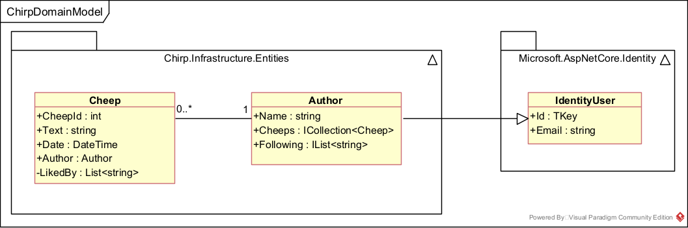

---
title: _Chirp!_ Project Report
subtitle: ITU BDSA 2025 Group 8
author:
- "Charlotte Plateig <cpla@itu.dk>"
- "Frederik Hørup <frap@itu.dk>"
- "Marie Johansen <majoh@itu.dk>"
- "Nikolej Lundquist <nivl@itu.dk>"
- "Sara Bagger <salb@itu.dk>"
numbersections: true
---

# Design and Architecture of _Chirp!_

## Domain model
The Domain Model of the _Chirp!_ application consists of `Cheep`, `Author` and `IdentityUser`. A `Cheep` is written by an `Author` that inherits from `IdentityUser` as visualized below.

 
*Illustration of the _Chirp!_ Domain Model*

## Architecture — In the small
The code base is structured according to the onion architecture template,
with one notable exception. Usually, the domain entities are situated within the core of the application,
which was also the case for this app, before EF Core Identity was implemented.
With this task came some decisions about how to handle the author/Identity user semantics.
Ultimately, it was decided that Identity users and cheep authors would be combined
by having the Author class inherit from Identity user,
to avoid complications between different types of user accounts.
As a result, the domain entities were moved to `Chirp.Infrastructure`
to accommodate this decision.
Besides this discrepancy, the Chirp! application adheres to the standard onion architecture template.
Below is an overview of the codebase structure.

*Illustration of the Chirp! app codebase structure - based on onion architecture.*

- `Chirp.Core` contains the interfaces and data transfer objects (DTOs).
- `Chirp.Infrastructure` contains the domain entities, repositories, and the Data package,
which is responsible for the DB context and initializing.
- `Chirp.Web` contains the Program.cs file, all razor pages and their respective page handlers.
The Cheep and Author services are also located here.
- The test suite resides in a separate directory that mirrors the structure of the source code. I.e. the tests for
`src/Chirp.Infrastructure/Repositories/CheepRepository.cs`
are found in
`tests/Chirp.Infrastructure.Tests/Repositories/CheepRepositoryTest.cs`.
UI and end-to-end tests generated using Playwright are located in `Chirp.Web.Tests`.

## Architecture of deployed application
The diagram below shows rhe deployment architecture of the Chirp! application. The system follows a client-server architecture, where users interact with the application through a web browser. Client requests are sent over HTTPS to an ASP.NET Core Razor Pages application deployed on Azure App Service.
  

## User activities

## Sequence of functionality/calls trough _Chirp!_

# Process

## Build, test, release, and deployment

## Team work

## How to make _Chirp!_ work locally

## How to run test suite locally

# Ethics

## License

## LLMs, ChatGPT, CoPilot, and others
