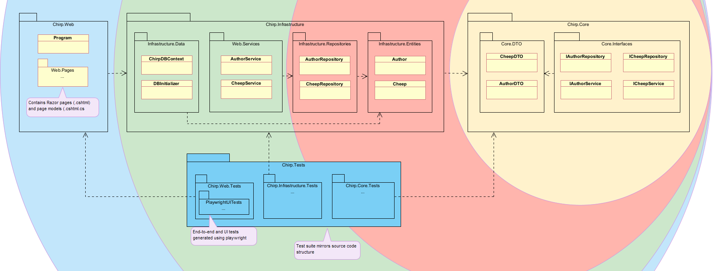
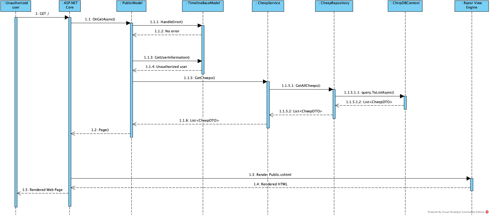

---
title: _Chirp!_ Project Report
subtitle: ITU BDSA 2025 Group 8
author:
- "Charlotte Plateig <cpla@itu.dk>"
- "Frederik Hørup <frap@itu.dk>"
- "Marie Johansen <majoh@itu.dk>"
- "Nikolej Lundquist <nivl@itu.dk>"
- "Sara Bagger <salb@itu.dk>"
numbersections: true
---

# Design and Architecture of _Chirp!_

## Domain model

Here comes a description of our domain model.

## Architecture — In the small
The code base is structured according to the onion architecture template,
with one notable exception. Usually, the domain entities are situated within the core of the application,
which was also the case for this app, before EF Core Identity was implemented.
With this task came some decisions about how to handle the author/Identity user semantics.
Ultimately, it was decided that Identity users and cheep authors would be combined
by having the Author class inherit from Identity user,
to avoid complications between different types of user accounts.
As a result, the domain entities were moved to `Chirp.Infrastructure`
to accommodate this decision.
Besides this discrepancy, the Chirp! application adheres to the standard onion architecture template.
Below is an overview of the codebase structure.

*Illustration of the Chirp! app codebase structure - based on onion architecture.*

- `Chirp.Core` contains the interfaces and data transfer objects (DTOs).
- `Chirp.Infrastructure` contains the domain entities, repositories, and the Data package,
which is responsible for the DB context and initializing.
- `Chirp.Web` contains the Program.cs file, all razor pages and their respective page handlers.
The Cheep and Author services are also located here.
- The test suite resides in a separate directory that mirrors the structure of the source code. I.e. the tests for
`src/Chirp.Infrastructure/Repositories/CheepRepository.cs`
are found in
`tests/Chirp.Infrastructure.Tests/Repositories/CheepRepositoryTest.cs`.
UI and end-to-end tests generated using Playwright are located in `Chirp.Web.Tests`.

## Architecture of deployed application

## User activities

## Sequence of functionality/calls trough _Chirp!_

*Illustration of the sequence of functionality/calls trough _Chirp!_ from an unauthorized user's perspective.*

The image above illustrates the sequence of interactions which occurs, when an unauthorized user first 
accesses the application on the public timeline. An HTTP GET request to the root endpoint "/" is received by 
ASP.Net Core, which calls the Public Models (`public.cshtml.cs`) OnGetAsync method.
From there, the user is identified as unauthenticated by the ASP.NET Core authentication system and treated as 
anonymous. Through a couple of lifelines, a list of cheeps is collected and returned to ASP.Net Core. ASP.Net 
Core then renders the `public.cshtml` page through the Razor Page engine and returns the rendered HTML 
to the user.

# Process

## Build, test, release, and deployment

## Team work

## How to make _Chirp!_ work locally

## How to run test suite locally

# Ethics

## License

## LLMs, ChatGPT, CoPilot, and others
